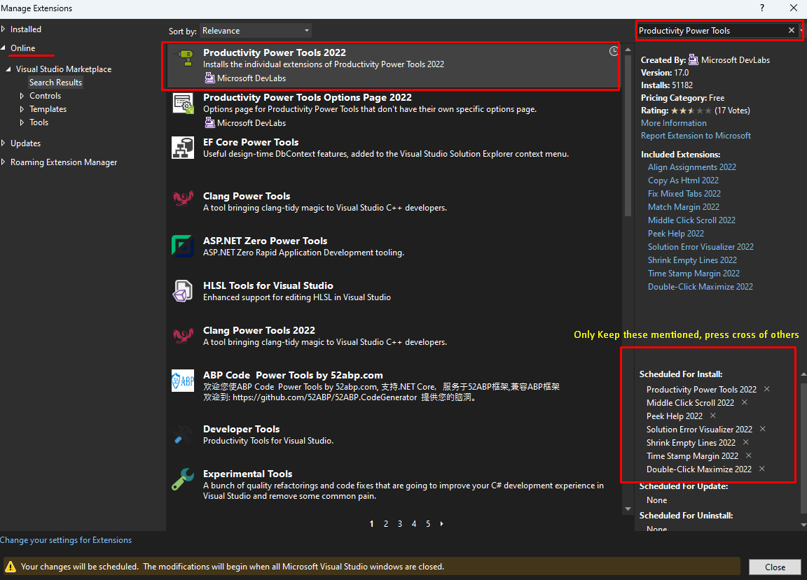
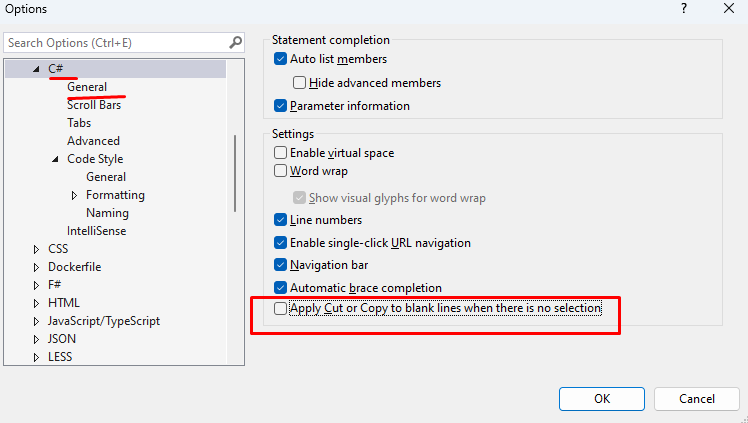
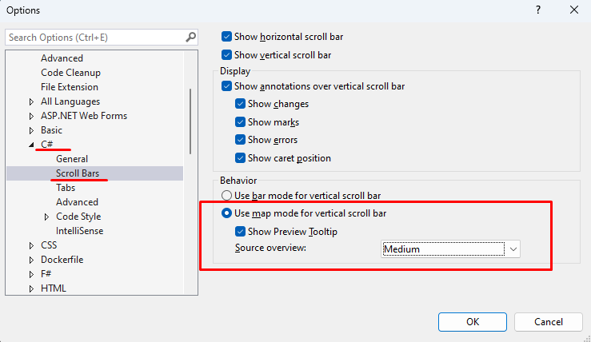
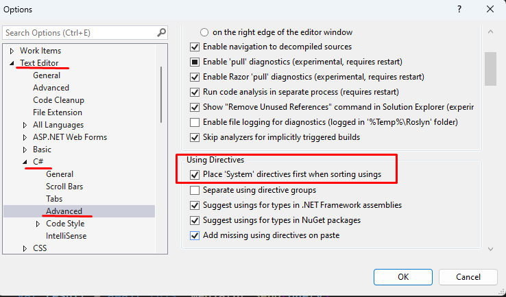
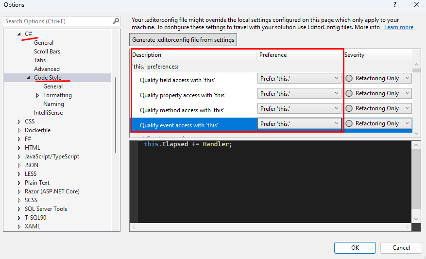
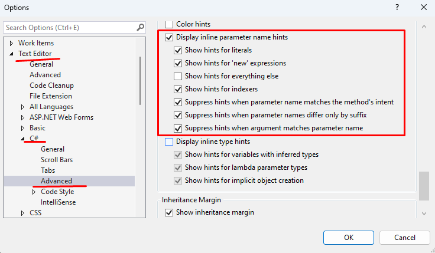
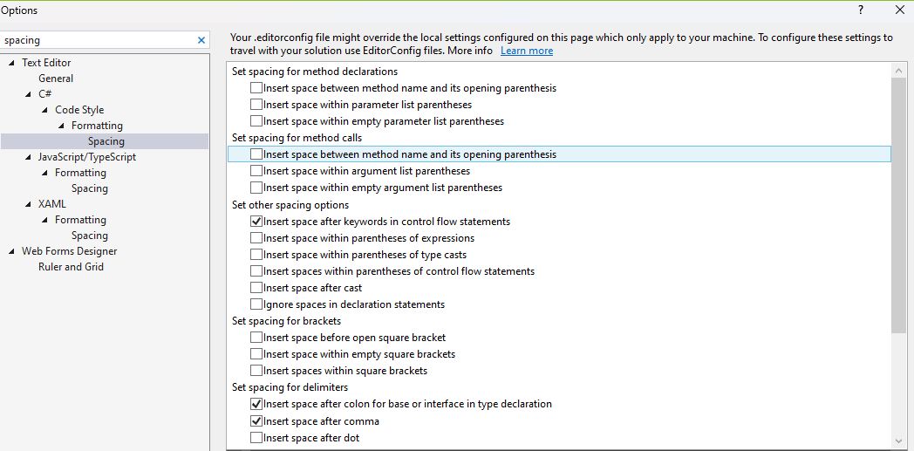
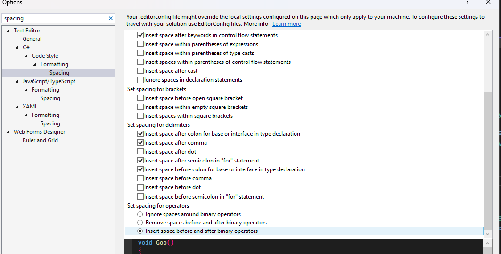
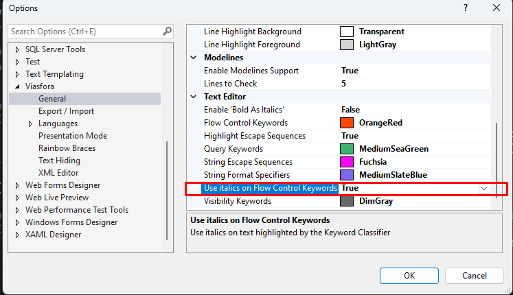

# Visual Studio Guide

Here we will provide you getting started guide for Visual Studio with better productivity for development using external extensions and cofigurations.

### Extensions

- [File Icons](https://marketplace.visualstudio.com/items?itemName=MadsKristensen.FileIcons)
 - [Productivity Power Tools](https://marketplace.visualstudio.com/items?itemName=VisualStudioPlatformTeam.ProductivityPowerPack2022)
   - Middle-Click Scroll 2022
   - Solution Error Visualizer 2022
   - Shrink Empty Lines
   - Time Stamp Margin 2022
   - Double-Click Maximize 2022
 

 - [VSColorOutput](https://marketplace.visualstudio.com/items?itemName=MikeWard-AnnArbor.VSColorOutput)
 - [Viasfora](https://marketplace.visualstudio.com/items?itemName=TomasRestrepo.Viasfora)
 - [SideScroller](https://marketplace.visualstudio.com/items?itemName=drewnoakes.SideScroller)
 - [Format Document On Save](https://marketplace.visualstudio.com/items?itemName=mynkow.FormatdocumentonSave)

 ### Vistual Studio Options
 
 Do the following in Tools > Options

